<p align="center">
  
</p>

<h1 align="center">
 Dragoon Games Store Web
</h1>

<p align="center">

  

  

  <a href="https://www.linkedin.com/in/alquiponeto/">
      
  </a>

  <a href="https://github.com/Alquipo/dragoongames-web/commits/master">
      
  </a>

  

  

</p>

<p align="center">

  <a target="_blank" href="https://nextjs.org/">
    
  </a>

   <a target="_blank" href="https://pt-br.reactjs.org/">
    
  </a>

   <a target="_blank" href="https://storybook.js.org/">
    
  </a>

  <a target="_blank" href="https://storybook.js.org/">
    
  </a>

   <a target="_blank" href="https://storybook.js.org/">
    
  </a>

   <a target="_blank" href="https://storybook.js.org/">
    
  </a>

</p>

## 🚀 Sobre o Projeto

Dragoon Games Store é um e-commerce completo para comprar jogos, nesse repositório estão os arquivos da pagina web da loja, Aplicação foi desenvolvida usando NextJS, ReactJS, Storybook, Jest, Styled-Components, Stripe, Next Auth, Apollo e GraphQl. aplicação está completamente integrada com a [API](https://github.com/Alquipo/dragoongames-api) efetuando pagamentos, Wishlist, carrinho de compras.

Para ver a API desenvolvida com Strapi acesse o [Github](https://github.com/Alquipo/dragoongames-api) e [DragoonGameAPI](https://dragoongames.herokuapp.com/admin/)

## 🎨 Layout

### Web

<h4 align="center">
  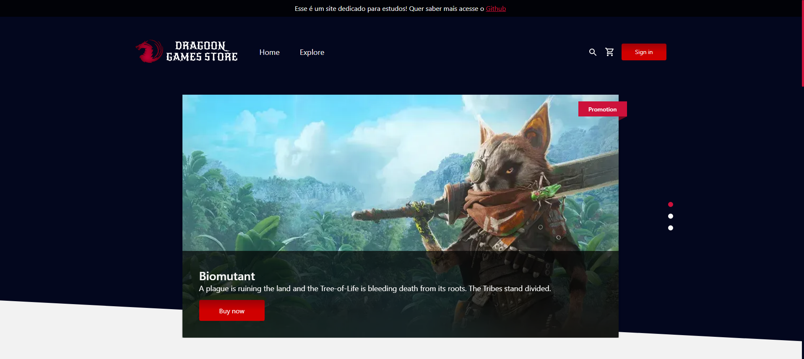
  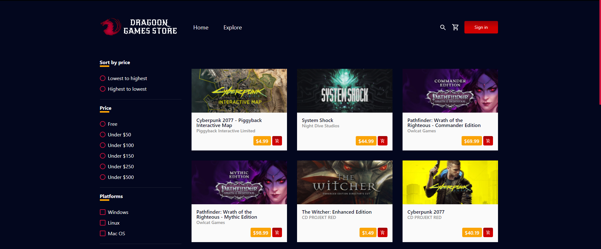
  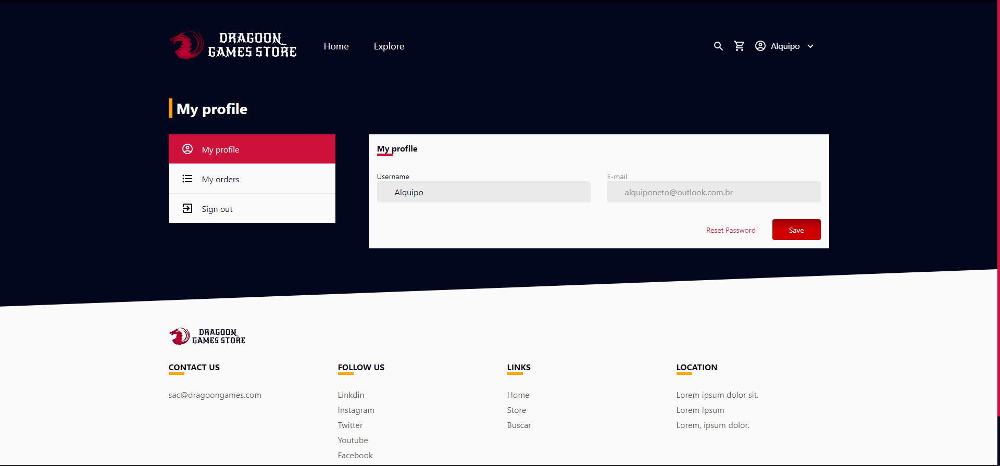
  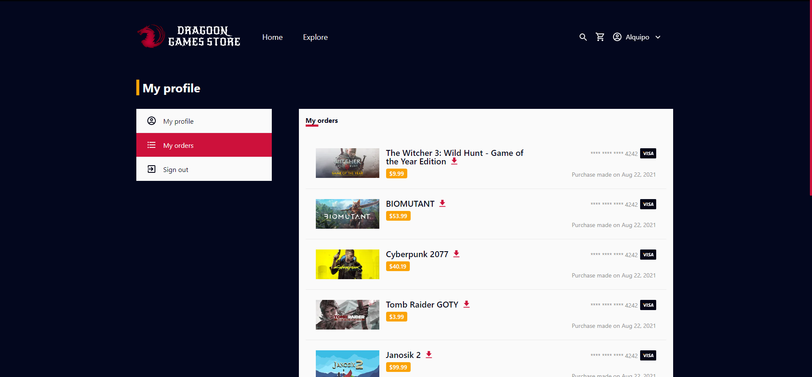
</h4>

### Mobile (PWA)

<h4 align="center">
  
  
  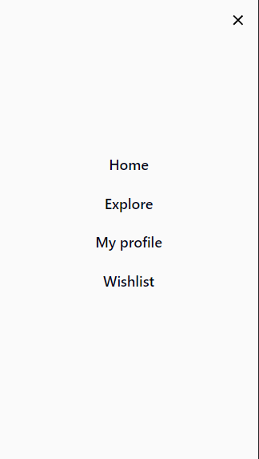
  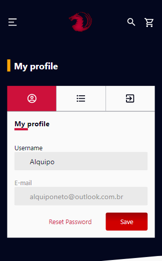
</h4>

#### Email Template

<h4 align="center">
  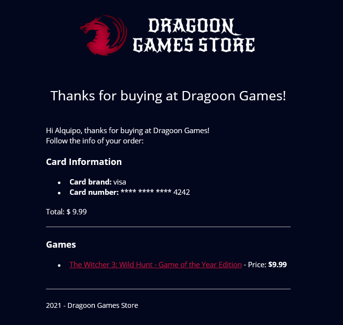
</h4>

### Storybook e Test

<h4 align="center">

  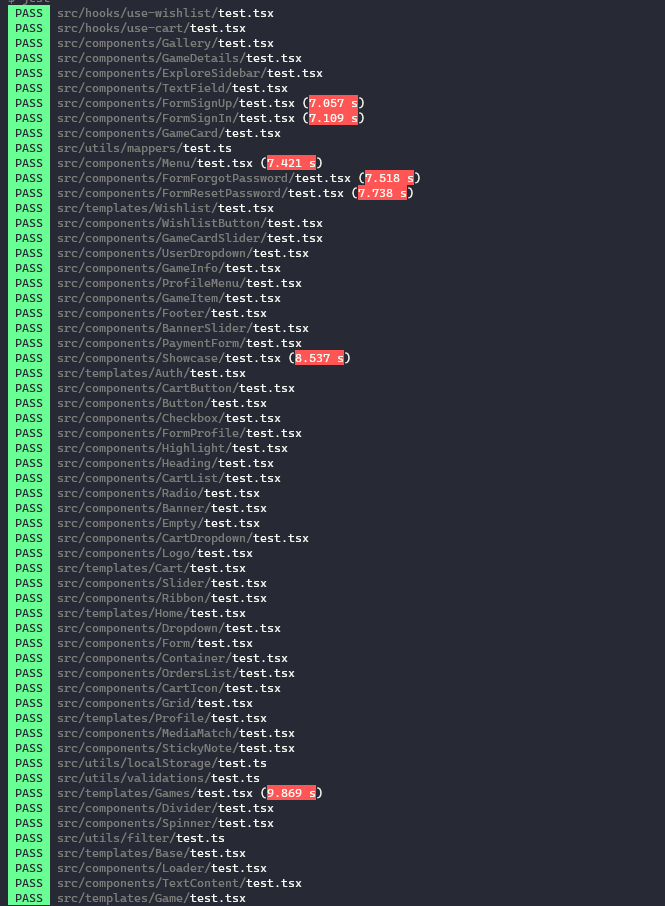
  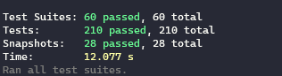
  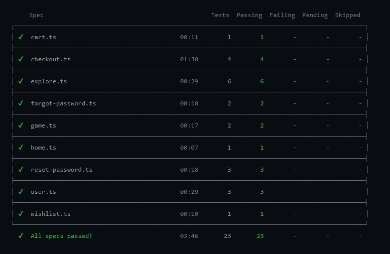
  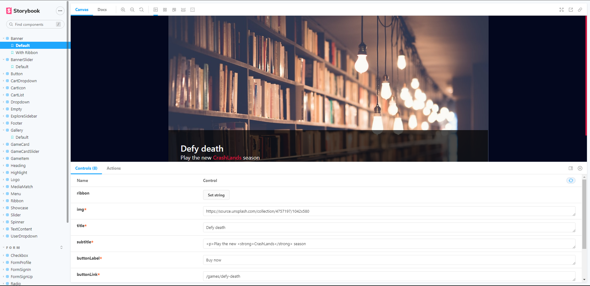

</h4>

<br/>

## 🎖️ Milestone

    -Adicionar o campo para efetuar buscas dos jogos 
    -Criar o App para Mobile com React-Native
    -Concluir os testes
    -Ajustes no Storybook ✔️
    -Adicionar botão show/hide no input password
    -Adicionar tooltip na tela de pagamento com informações do cartão de teste

## 🔨 Tecnologias:

- **[TypeScript](https://www.typescriptlang.org/)**
- **[NextJS](https://nextjs.org/)**
- **[GraphQL](https://graphql.org/)**
- **[Apollo](https://www.apollographql.com/)**
- **[JOI](https://joi.dev/)**
- **[Stripe](https://stripe.com/br)**
- **[Styled Components](https://styled-components.com/)**
- **[Jest](https://jestjs.io/)**
- **[Cypress](https://www.cypress.io/)**
- **[React Testing Library](https://testing-library.com/docs/react-testing-library/intro)**
- **[Storybook](https://storybook.js.org/)**
- **[Eslint](https://eslint.org/)**
- **[Prettier](https://prettier.io/)**
- **[Husky](https://github.com/typicode/husky)**
- **[PlopJS](https://plopjs.com/)**
- **[Polished](https://polished.js.org/)**
- **[Styled-Icons](https://styled-icons.js.org/)**
- **[MeiliSearch](https://www.meilisearch.com/)**

## 🔎 Comandos

- `dev`: Executa a aplicação em `localhost:3000`
- `build`: Cria a Build do projeto
- `start`: Inicia um servidor simples com o código de produção
- `lint`: Executa o **Linter** em todos os componentes e páginas
- `test`: Executa **Jest** para testar todos os componentes e páginas
- `test:watch`: Executa **Jest** em watch mode
- `storybook`: Executa **Storybook** em `localhost:6006`
- `build-storybook`: Cria uma build do storybook
- `generate`: Cria automaticamente um componente
- `test:e2e`: executa o server e abre o teste de cypress
- `cy:open`: Abre o test do cypress

## 🚀 Como rodar este projeto

Para clonar e executar este aplicativo, você precisará de [Git](https://git-scm.com), [NodeJs](https://nodejs.org/en/), [API](https://github.com/Alquipo/dragoongames-api) e [Banco de dados](https://github.com/Alquipo/dragoongames-database) Instalado em seu computador.

Este Projeto necessita da [API](https://github.com/Alquipo/dragoongames-api) instalada e funcionando em seu computador.

### 🌀 Clonando o repositório

```bash
# Clone este repositório
$ git clone https://github.com/Alquipo/dragoongames-web

# Acesse a pasta do projeto no terminal/cmd
$ cd dragoongames-web
```

### 🎲 Rodando a Aplicação

```bash

# Instale as dependências
$ yarn install

# Execute a Aplicação em Desenvolvimento
$ yarn dev

# O servidor iniciará na porta:3000 - acesse http://localhost:3000

```

### 💾 Comandos Úteis

```bash
#Criação de um componente completo com (index.tsx / stories.tsx / styles.ts / test.tsx)
$ yarn generate ComponentName

#Rodar o Storybook
$ yarn storybook

#Rodar os testes unitários
$ yarn test

#Rodar os testes de Integração
$ yarn cy:open
```

### 📁 Configuração .ENV

```bash
#adicionado .env.example no projeto, lembrar de adicionar as variáveis de ambiente conforme o exemplo

# Localização da API
NEXT_PUBLIC_API_URL=http://localhost:1337

# URL da Autenticação NEXTAUH (use URL base do site)
NEXTAUTH_URL=http://localhost:3000

# Key publica do stripe
NEXT_PUBLIC_STRIPE_PUBLISHABLE_KEY=

# localização das imagens local
NEXT_PUBLIC_IMAGE_HOST=http://localhost:1337

#Google Analytics
NEXT_PUBLIC_GA_TRACKING=

```

## 🤔 Como contribuir para o projeto

- Faça um **fork** do projeto;
- Crie uma nova branch com as suas alterações: `git checkout -b my-feature`
- Salve as alterações e crie uma mensagem de commit contando o que você fez:`git commit -m "feature: My new feature"`
- Envie as suas alterações: `git push origin my-feature`

> Caso tenha alguma dúvida confira este [guia de como contribuir no GitHub](https://github.com/firstcontributions/first-contributions)

## 📝 Licença

Este projeto esta sobe a licença MIT. Veja a [LICENÇA](https://opensource.org/licenses/MIT) para saber mais.

Feito com ❤️ por Alquipo Neto 👋🏽 [Entre em contato!](https://www.linkedin.com/in/alquiponeto/)
